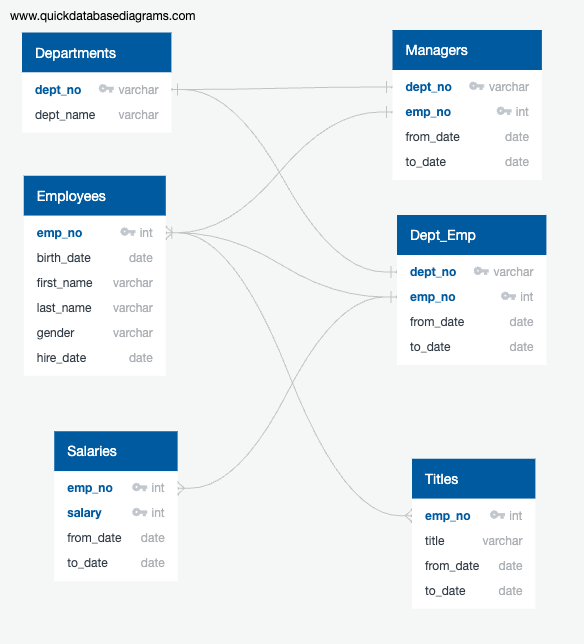

# Retirement_Analysis_SQL

## Overview of the analysis:
At present, big data is getting more and more popular and it requires us to learn more tools to better analysis big data to meet the business requirements. During this analysis, we will use SQL which is currently most well-known database analysis tool. We learnt how to import the raw database and use many SQL functions to select dataset as required. 

## The purpose of the new analysis is well defined. 
AS SQL is powerful data analysis tool/database. This challange is utilize the SQL to determine the number of retiring employees per title, and identify employees who are eligible to participate in a mentorship program. 

## Results: 
- 
[retirement_titles](Pewlett-Hackard-Analysis/retirement_titles.csv)

- 
[unique_titles](Pewlett-Hackard-Analysis/unique_titles.csv)

-
[retiring_titles](Pewlett-Hackard-Analysis/retiring_titles.csv)

-
[mentorship_eligibilty](Pewlett-Hackard-Analysis/mentorship_eligibilty.csv)

## Summary - The summary addresses the two questions and contains two additional queries or tables that may provide more insight. 
